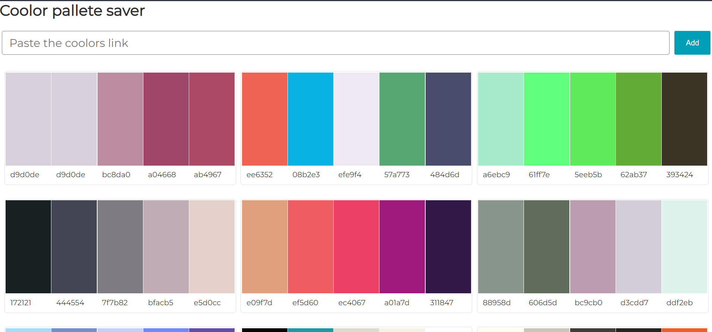

## Introduction

This website lets you save your coolor generated pallete. Simply copy the url and your pallete will be saved
## Setup

### Clone the repo

``` bash
    git clone https://github.com/bhagwanZaki/coolor_pallete_frontend_next.git
```

### install packages

```bash
    npm i
```

### Run the development server:

```bash
    npm run dev
```

Open [http://localhost:3000](http://localhost:3000) with your browser to see the result.

### Output

